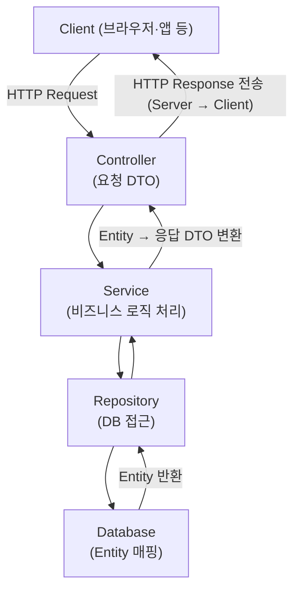

## Spring Boot Request–Response Flow

---

## Spring Boot Core Layers and Responsibilities

### Entity
- 데이터베이스 테이블과 1:1로 매핑되는 클래스
- 필드 = 컬럼
- @Entity 어노테이션 사용
- Repository가 직접 다룸

### Repository
- Entity에 대한 CRUD 쿼리 수행
- JpaRepository<Entity, ID> 같은 인터페이스 상속
- DB 접근 계층
- Service가 호출함

### Service
- 비즈니스 로직 처리 계층
- 여러 Repository를 조합하거나 데이터 가공 수행
- Controller에서 호출됨
- 트랜잭션 관리 주체

### DTO (Data Transfer Object)
- Controller와 Service 간, 혹은 API 응답/요청에서 사용하는 데이터 전달용 객체
- Entity를 그대로 노출하지 않기 위해 사용
- Service에서 Entity ↔ DTO 변환 수행

### Controller
- HTTP 요청을 받는 진입점
- @RestController나 @Controller 사용
- Service 호출 후 결과를 DTO로 반환
- 요청 DTO → Service 호출 → 응답 DTO 반환 흐름
