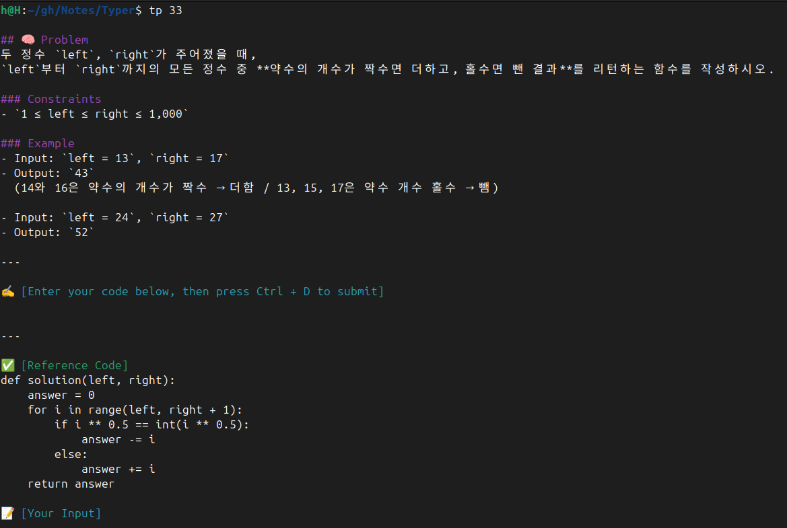
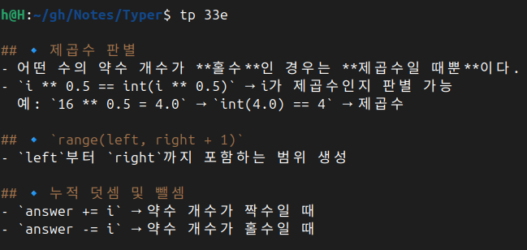

# 🧠 CLI Typer

기초 문법 문제를 반복 타이핑하며 학습하는 CLI 도구입니다. 
이 자료에 포함된 모든 문제는 Programmers에 수록된 문제입니다.

---

## ✅ 설정 & 실행

```bash
chmod +x setup.sh
./setup.sh
```

- tp 문제번호 -> 문제 출력
- tp 문제번호e -> 풀이 출력

---

## 💡 Tip

- typer.sh는 문제 폴더들의 상위 디렉토리에 위치해야 합니다.
- tp 명령어는 프로젝트 루트 디렉토리를 기준으로 동작합니다.

---

## 🚀 실행 화면



---



